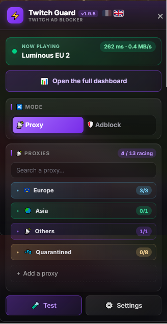
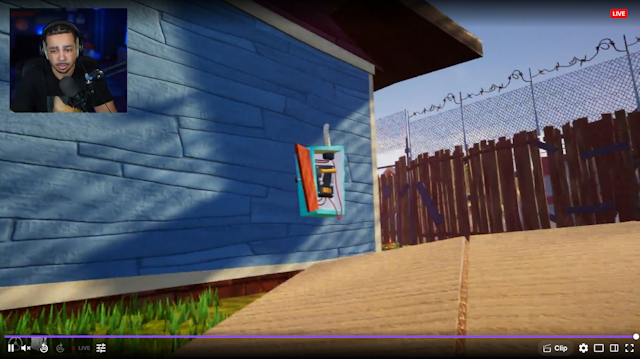
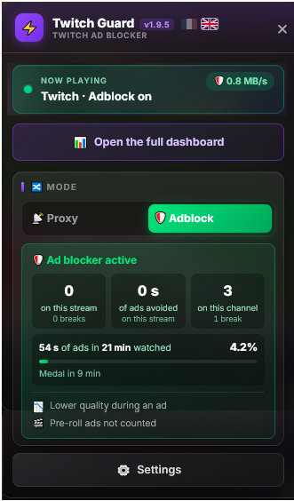
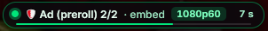
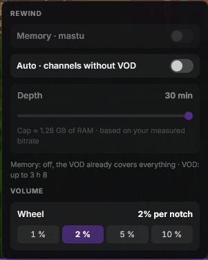
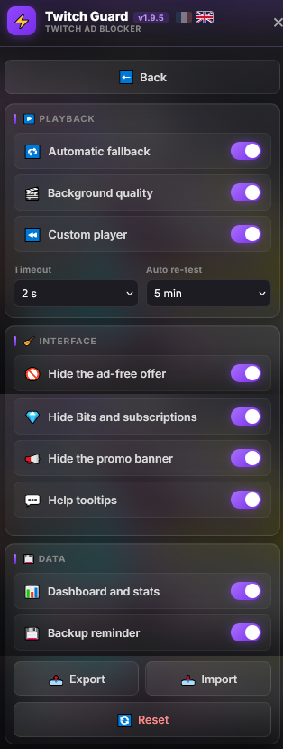
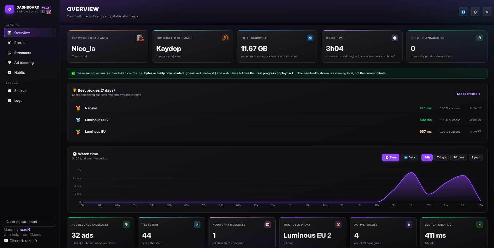
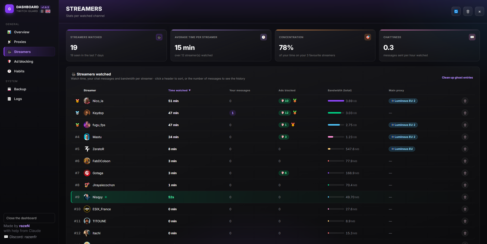
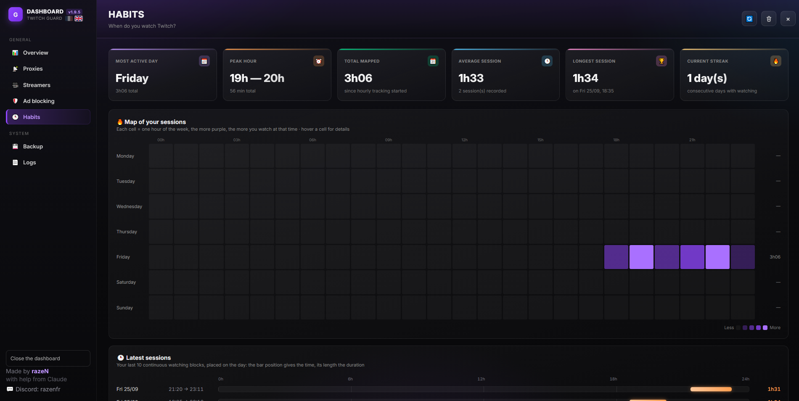

# 🛡️ Twitch Guard

**A userscript that blocks Twitch ads, adds a rewind timeline to live streams, and comes with a full stats dashboard.**

Twitch Guard runs in Tampermonkey, right on twitch.tv. No extra extension, no account to create. All your data stays in your browser.

  
  &nbsp;&nbsp;
  

---

## Contents

- [Installation](#-installation)
- [Two ways to block ads](#-two-ways-to-block-ads)
- [The custom player: rewind live streams](#-the-custom-player-rewind-live-streams)
- [The script menu](#️-the-script-menu)
- [The dashboard](#-the-dashboard)
- [Backing up your stats](#-backing-up-your-stats)
- [Privacy](#-privacy)
- [FAQ](#-faq)
- [Credits](#-credits)

---

## 📥 Installation

1. Install the **[Tampermonkey](https://www.tampermonkey.net/)** extension for your browser (Chrome, Edge, Brave, Firefox, Opera…).
2. Click this link: **[Install Twitch Guard](https://raw.githubusercontent.com/razeNFR/proxyivshook/main/proxyivshook.user.js)**.
3. Tampermonkey opens an install page: click **Install**.
4. Open (or reload) a stream on twitch.tv. The 🛡️ button shows up next to the **Follow** button.

> **Updates**: the script checks for new versions on its own. When one is available, a red dot appears on the 🛡️ button and a banner shows up in the menu. One click and you're updated.

---

## 🔀 Two ways to block ads

You pick the mode at the top of the menu, and you can switch at any time: the player restarts on its own.

  
  &nbsp;&nbsp;
  

### 📡 Proxy mode

The stream goes through **proxies located in countries where Twitch doesn't serve ads**.

- **13 built-in proxies**, grouped by region (Europe, North America, Asia).
- **Parallel race**: all proxies are asked at the same time and the fastest one wins. Startup isn't slowed down.
- **Automatic testing** of latency and success rate, then proxies are sorted from fastest to slowest.
- **Automatic quarantine**: a proxy that hasn't answered for days is set aside and retested every hour. It comes back on its own as soon as it works again.
- **Custom proxies**: add your own and choose their priority order.
- **Watchdog**: if the picture freezes, the player restarts through another proxy.
- **Fall back to Twitch** (can be turned off): if no proxy answers, the stream goes back through Twitch. An alert warns you, since ads may come back.

### 🛡️ Adblock mode

Twitch is played **directly, without any proxy**, so you keep your usual quality (2K/4K included). When an ad comes up:

- the script grabs **the same stream from another Twitch player that has no ads** and shows it to you for the length of the break;
- if it can't find one, the ad is replaced by a blank image;
- when the break is over, the player switches back to the normal stream.

A **badge in the top-left corner of the player** tells you what's going on: ad number ("Ad 2/3"), quality of the backup stream, time left with a progress bar, then a countdown until playback resumes.

  

The menu also counts **ads blocked** on the stream and on the channel, the ad time you avoided, and works out **each channel's ad share**. After 30 minutes of watching, every channel gets a medal: 🏆 zero ads · 🥇 · 🥈 · 🥉 · 💩 lots of ads.

> During an ad, quality may drop for a moment. That's the quality of the backup player, not of your stream. Pre-roll ads (at the start of a stream) are blocked but not counted: they depend on when you join, not on the streamer.

---

## ⏪ The custom player: rewind live streams

The script adds its controls **right inside the Twitch player bar**, without replacing it.

  

- **Rewind timeline** above the controls. Click or drag to go back, then hit **LIVE** to return to the live edge. Hovering the bar shows how far back you'd go.
- **⟲30 / ⟳30** to go back or forward 30 seconds. Quick clicks add up (two clicks = −1 min).
- **Playback speed** from 0.5× to 2× while watching the past.
- **Pause on live**: when you resume, you pick up **right where you stopped**, not at the live edge.
- **Catch up after a pause**: if you pause the Twitch player and then resume, a notification offers to replay what you missed.
- **Mouse-wheel volume** over the whole player, with an adjustable step (1, 2, 5 or 10%).
- **End of stream**: when the streamer goes offline, you can still rewind to rewatch the ending.

**Where does the past come from?**

| Source | When | How far back |
|---|---|---|
| The channel's **VOD** | The streamer saves their broadcasts (including subscriber-only VODs, in most cases) | The whole stream |
| **Memory** | The channel has no VOD: the script keeps the last few minutes in RAM | 30 s to 30 min, your choice |

Memory is turned on from the player settings (the sliders icon), channel by channel or automatically on every channel without a VOD. On the timeline, **purple** shows what's already been recorded.

  

---

## ⚙️ The script menu

Click the 🛡️ button next to **Follow**, or press **Alt + P**.

  

**Main screen**
- **Now playing**: the proxy in use, its latency and the current bitrate.
- **Mode**: Proxy or Adblock.
- **Proxy list** (Proxy mode): collapsible groups, search, one-click toggle, add a custom proxy, and the 🧪 **Test** button.
- **Ad blocker card** (Adblock mode): ads blocked, ad time avoided, the channel's ad share and its medal.

**Settings screen**
- **Playback**: fall back to Twitch, keep quality when the tab is in the background, custom player on or off, timeout and how often proxies are retested.
- **Interface**: hide the "ad-free" offer, hide the Bits and subscribe buttons (the Follow button stays), or hide the promo banner under the player. You can also turn off the help tooltips.
- **Data**: turn stats on or off, automatic backup, **export and import** of your settings, reset.

**🇫🇷 / 🇬🇧 Language**: the script shows up in French or English depending on Twitch's language. The flags next to the title let you force one.

---

## 📊 The dashboard

The **Open the full dashboard** button opens your stats in a new tab, without stopping the stream you're watching.

  

| Tab | What you'll find |
|---|---|
| **Overview** | Your most watched and most "chatted" streamer, your bandwidth, your watch time, ads blocked, the best proxies. A chart of watch time or data used over 24 h, 7 days, 30 days or 1 year. |
| **Proxies** | The full ranking: score, latency measured by tests and real latency during playback, trend line, success rate, number of uses. |
| **Streamers** | For each channel: watch time, messages you sent (with their history), ads blocked, bandwidth, main proxy. Channels playing right now show up in green and their numbers update live. |
| **Ad blocking** | Each channel's ad share and medal, longest break, backup streams used, the last 15 ad breaks. |
| **Habits** | An hour-by-hour heatmap of your week, your latest sessions laid out on the day, the split by day of the week, your streak of consecutive days. |
| **Backup** | See the next section. |
| **Logs** | A log of everything the script does, with filters and a search. **Detailed logs** help track down a problem. |

  
  &nbsp;
  

Stats from several Twitch tabs open at the same time add up correctly, with nothing counted twice.

---

## 💾 Backing up your stats

Your stats are stored in your browser. If you clear your browsing data, they're gone. To avoid that:

- **Chrome, Edge, Brave, Opera**: pick a file once, and the script rewrites it on its own **every 15 minutes**.
- **Firefox**: a reminder regularly asks you to download a backup in one click.

**Restoring** merges the backup with your current stats and always keeps the most complete value: nothing is counted twice.

---

## 🔒 Privacy

- Your stats stay **only in your browser**. They're never sent anywhere.
- In **Proxy mode**, the proxy receives the name of the channel you're watching. It gets **neither your cookies nor your Twitch account**.
- In **Adblock mode**, nothing goes through a third-party server: it's just your browser and Twitch.
- The script only talks to Twitch, the proxies (in Proxy mode) and GitHub (to check for updates).

---

## ❓ FAQ

**The 🛡️ button doesn't show up.**
Check that the script is enabled in Tampermonkey, then reload the page. The button only appears on a channel page, not on the home page. In theatre mode, it sits to the left of the chat settings gear.

**I still got an ad in Proxy mode.**
Click 🧪 **Test** to rerun the tests, or try Adblock mode. You can also check the **Logs** tab of the dashboard, which explains where the ad came from.

**Rewind is greyed out.**
The channel has no VOD and memory isn't turned on. Turn it on in the player settings (sliders icon). It then needs 30 seconds of recording before you can go back.

**I want to report a bug.**
Turn on **detailed logs** (dashboard → Logs), reproduce the problem, then send me the log lines along with the script version (shown next to the title in the menu).

---

## 🙏 Credits

- Adblock mode is based on the method from [TwitchAdSolutions (vaft)](https://github.com/pixeltris/TwitchAdSolutions), rewritten for this script.
- VOD playback powered by [hls.js](https://github.com/video-dev/hls.js).

> This project is not affiliated with or endorsed by Twitch. It is provided as is, without any warranty.
